# CCE AIML - learning data compression for Machine learning
### by  Shriti Singh , Parinita Bora
## The algorithms experimented with with high resolution image data  as a part of preprocessing of data  :SVD, PCA, K-mean 
 
For training a machine learning model When there is large amount of unlabeled data, unsupervised learning algorithms helps in the undestanding of the data. Unsupervised learning also can help in dimensionality reduction. Dimensionality reduction again can help in data visualization (e.g. t-SNA method).When the data is reduced, the complexity of the model can be reduced, so as the traing time.
####  an example data file with dimention 570X 985 x 3 is an image of Cosmic object, Captured by James Webb Space Telescope (publicly available in Nasa wesite)                                                                                                                    
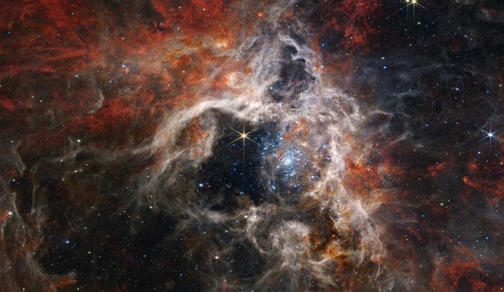 

A brief note about the three unsupervised methods 

| Method                          | Inventor(s)                                                | Purpose   |    |
|--------------------------------  | -----------------------------------|-------------------------------------  |----|
| Singular Value Decomposition(SVD) - https://en.wikipedia.org/wiki/Singular_value_decomposition  | Independently Eugenio Beltrami, Camille Jordon over 100 yrs back   | To predict a set of optimal factors.| 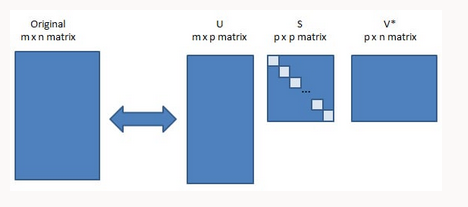 |
| Principal comonent Analysis(PCA) - https://en.wikipedia.org/wiki/Principal_component_analysis | Karl Pearson in 1901, later in 1930, developped by Harold Hotelling | Dimnetionality reduction   | ![pca scat] ()      |
| K-Means clustering  -            https://en.wikipedia.org/wiki/K-means_clustering             | First used by James MacQueen in 1967 ,used by Steinhaus in 1956    | In pulse code modulation(by Steinhaus) |   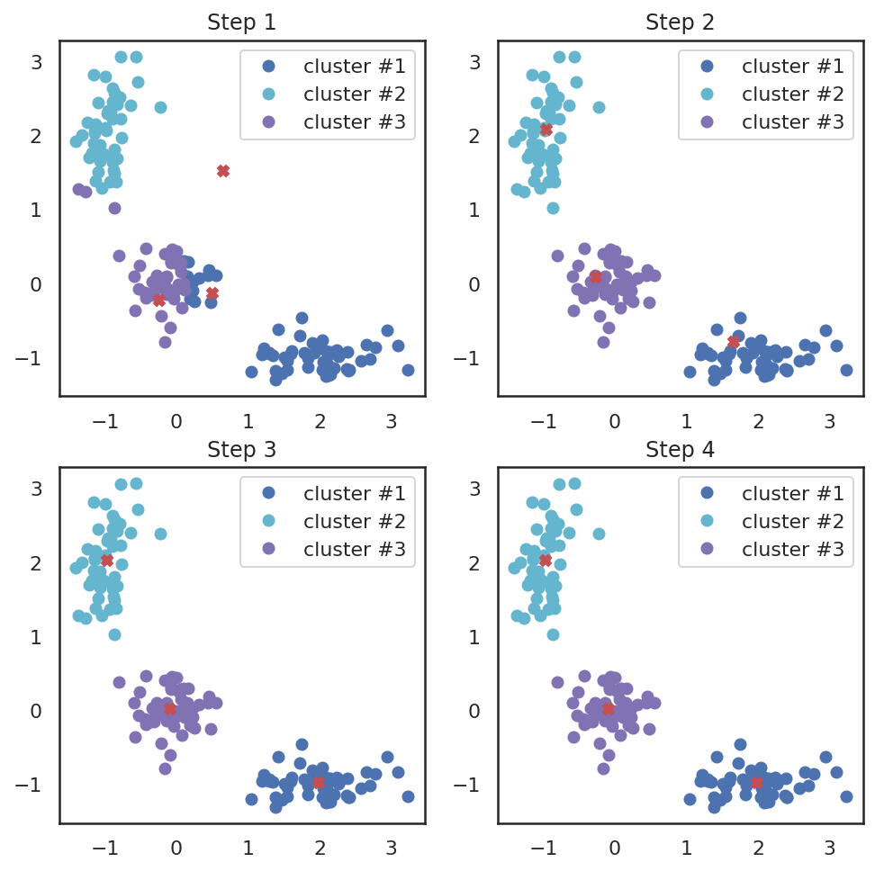  |

Advantages 
1. SVD : SDV simplifies data, can remove noise also it can be used for coloured image to segregation components for computational efficiency
2. PCA : Dimentionality reduction is the biggest advantage preserving most significant data. PCA can also used in data exploratory analysis and visualization
3. K-Mean : Simplicity and guarntees convergence. It provides good representation of reduced features/ data.  

## 1. PCA is commonly used  unsupervised dimensionality reduction method.
The data is projected onto its orthogonal subspace, that may help in reducing unwanted input data. 

In the figure the observations are in ellipsoid feature space.If the basis set vectors are orthogonal, highly correlated features can be removed, now the data  lies in a subspace having a smaller dimension.
This allows reduction of space with the newer projection. Each of the ellipsoid axes with maximal dispersion is choosen. 

### The steps in PCA mathematics 
Step1. Calculate the covariance matrix of the data
step2. Extract the eigenvectors and the eigenvalues of that matrix
Step3. Select the number of desired dimensions and filter the eigenvectors to match it, sorting them by their associated eigenvalue
Step4. Multiply the original space by the feature vector generated in the previous step.

The compression ratio calculated for a experimented components :
new_number_of_values in the image matrix =570*components+985*components+components
compression ratio = ((original_number_of_values-new_number_of_values after applying PCA )/original_number_of_values)*100

| Algorithm                         | The detailed implementation  notepads |                                                       
|---------------------------------|----------------------------------------|
| PCA                             |  https://drive.google.com/file/d/1_pBJL6v9sRRetdD0tLqvmihOVvtvivf8/view?usp=share_link |
                     

### Experimental Results for  PCA

https://github.com/Gitpabora/Data_reduction_compression/tree/main/data/output

|components(Principal component)  |  compression ratio (%)    |  Explained variance                        | Reconstructed Image           |    
|------------ | ------------- | -----------------------------------------|-------------------------------|
| 10          |  99.076    | 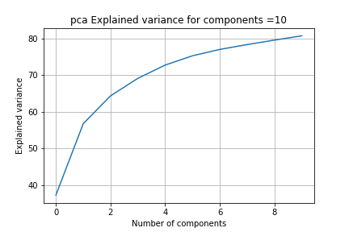 |  | 
| 20          |  98.15    | 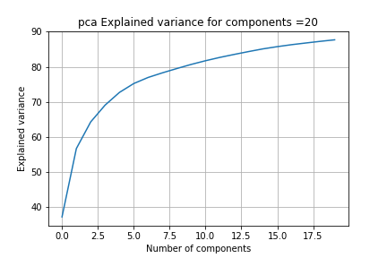  |  |
| 30          |  97.23   | 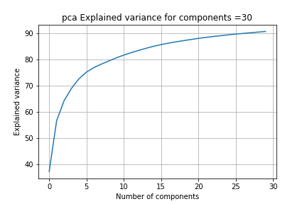  |  | 
| 40          |  96.30   | 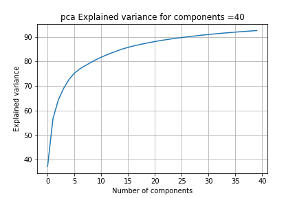  |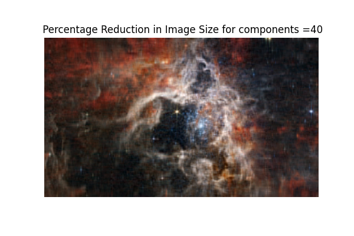  | 
| 50          |  95.38    | 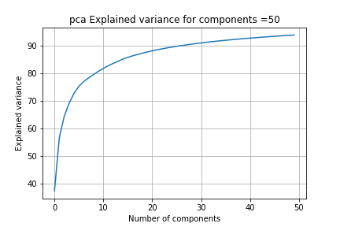  |  | 
| 60          |  94.46    | 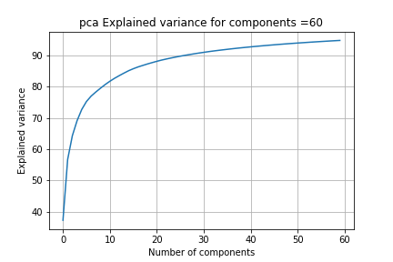  |  | 
| 70          |  93.53    |   | 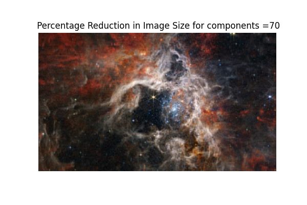 | 
| 80          |  92.61    | 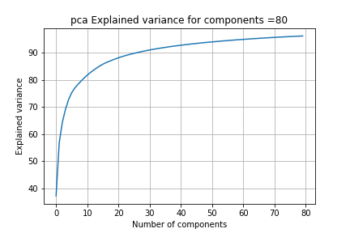  |  | 
| 90      |  91.69    | 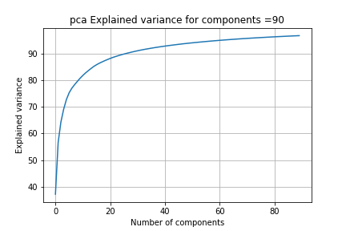    |  |  
| 100         |  90.76    | 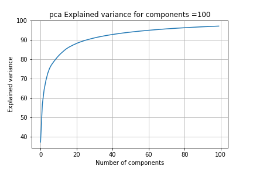 |  |

## 2. SVD is a matrix factorization method where matrix (M) is  decomposed into three matrices (e.g. U, S, V)
The data is projected onto its orthogonal subspace, that may help in reducing unwanted input data. 

Note: The image is referenced from Internet sources

Algorithm
refernce:  https://iopscience.iop.org/article/10.1088/1757-899X/263/4/042082

### SVD Steps:
Step1. getting three component matrices with Red , Blue and green constituents

Step2. Applying SVD on each of the three components to generate three vectors for each of the matrices

Step3. Preserving only K  ie Selecting k columns from U matrix and k rows from VT matrix, and resetting rest to zero

Step4. Reconstructing the coloured components from U and V

Step5. Final image is formed by concatenating the three components 

Step5. Calculating the  the compression ratio= (original_Bytes-compressed_Bytes) / original_Bytes * 100

| Algorithm                         | The detailed implementation  notepads |                                                       
|---------------------------------|----------------------------------------|
| SVD                             |  https://colab.research.google.com/drive/1eG843MHVTwohPAqRmsQa8JToxPNJZR1M?usp=share_link |

### SVD compression ratio and recostruction
|components(k)  |  compression ratio(%)     | Reconstructed image |   
|------------ | ------------------ |--------------------------|
| 10          |  97.23    | 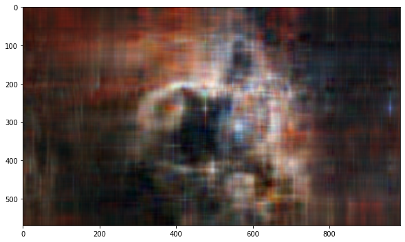 |
| 20          |  94.46    |  |
| 30          |  91.69    |  |
| 40          |  88.91    | 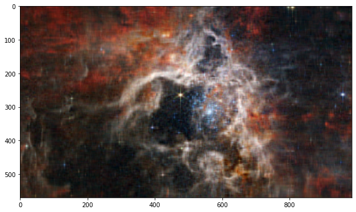 |
| 50          |  86.14    |  |
| 60          |  83.37    |  |
| 70          |  80.60    |  |
| 80          |  77.83    |  |
| 90          |  75.06    |  |
| 100         |  72.29    |  |

### Observations:
 1. in both the algorithms as the Number of principal component or K the compression  ratio decreases.

 2.Reconstruction for PCA is better at a lower value of number of prncipal components
 
 3.The compression ratio higher in PCA for the same value of component in PCA and K value in SVD
 
## 3. K-mean clustering is a simple and popular technique for data partitoning
##  

### K-mean steps :

 Step 1. An optimal number of cluster (K) is choosen.
 
 Step 2. k  number of points  "centroids" are initialized randomly within the data area.
 
 Step 3. Each data or observation is attributed to own closest centroid.
 
 Step 4. Updation is done for the centroids to hold the value corresponding to the center of  its all  attributed observations.
 
 Step 5. Steps 3-4  is repeated a number of times / until all of the centroids are prominent.
 
 ### Experimental Results for K-Mean
 ### compression ratio in K-Mean with respect to number of clusters
|number of clusters(k)  |  compression ratio(%)     | scatter plot |   
|------------ | ------------------ |--------------------------|
| 10          |  98.25    |  |
| 20          |  96.49    | 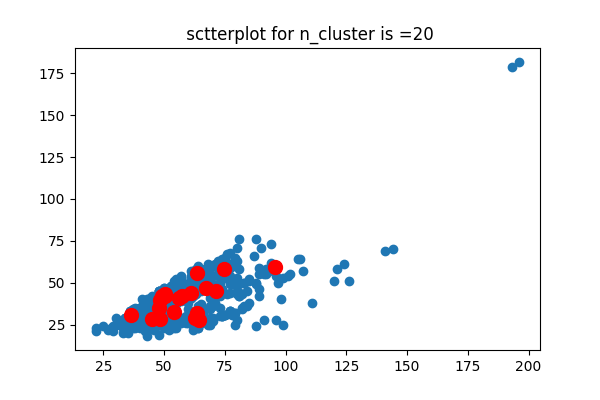 |
| 30          |  94.74    |  |
| 40          |  92.98    | 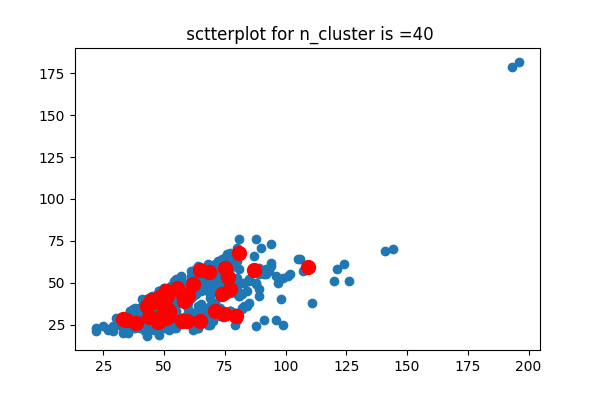 |
| 50          |  91.23    | 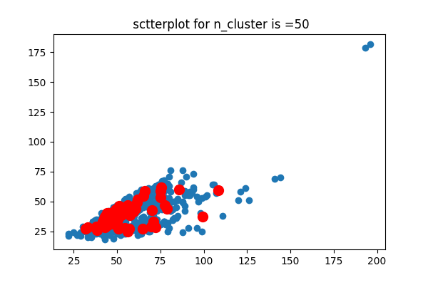 |
| 60          |  89.47    | 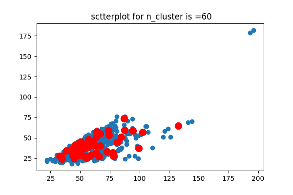 |
| 70          |  87.72    |  |
| 80          |  85.96    | 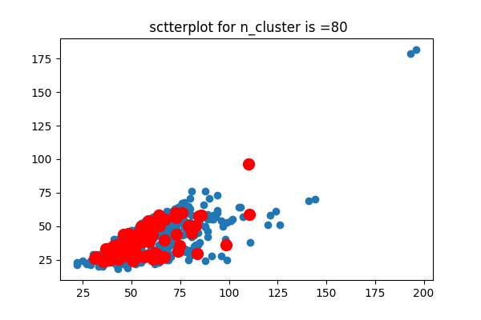 |
| 90          |  84.21    | 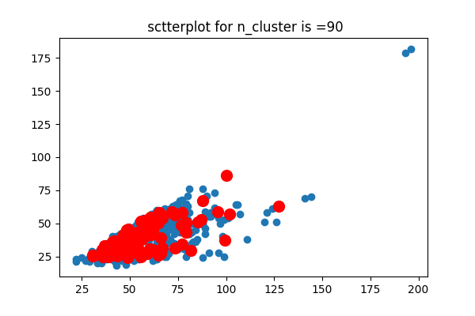 |
| 100         |  82.46    | 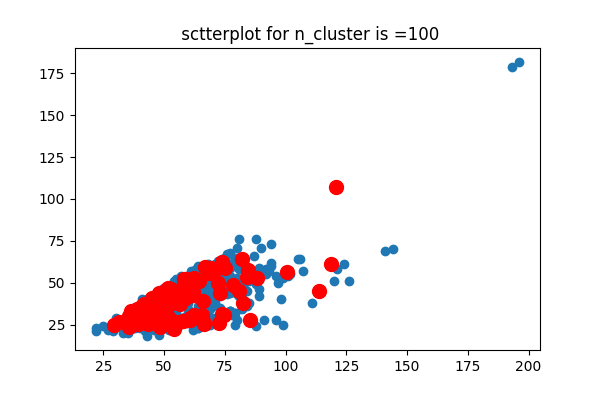 |

 

#### TO Do s : including the below

1. Exploring other data reduction techniques for ML
2. Most imporatnatly (a) Experimenting with large dataset and setting up github CI (b) test for the measures of these algorithms in terms of the impact on the model performance (c) when which algorthim is suitable.
Other References: 1) https://arxiv.org/pdf/1608.05148.pdf  2)https://bair.berkeley.edu/blog/2019/09/19/bit-swap/

Note:all numeric results are rounded to 2decimal places
